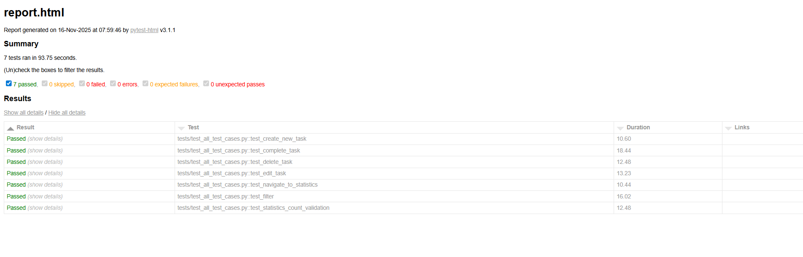

# TODO Appium E2E Tests – README

This document explains how to set up the environment, install dependencies, run the tests, launch the emulator, and view the generated test report.

----------------------------------------------------
# Environment Setup & Dependencies
----------------------------------------------------

# Create virtual environment
python -m venv venv

# Activate virtual environment
# Linux / Mac:
source venv/bin/activate
# Windows (PowerShell):
# venv\Scripts\activate

# Install required Python packages
pip install -r requirements.txt

# The project requires:
# - Python 3.9+
# - Appium-Python-Client
# - Selenium
# - Pytest + pytest-html
# - Appium server (v2+) installed via: npm install -g appium
# - Android SDK + AVD emulator
# - Java JDK 8+

----------------------------------------------------
# Emulator / Simulator Details
----------------------------------------------------

# List available Android Virtual Devices:
avdmanager list avd

# Start emulator:
# Linux / Mac:
emulator -avd Pixel_3a_API_30 -netdelay none -netspeed full &
# Windows (PowerShell):
# Start-Process emulator -ArgumentList "-avd Pixel_3a_API_30 -netdelay none -netspeed full"

# Wait a few seconds for emulator to fully start
sleep 10

----------------------------------------------------
# Instructions to Execute the Tests
----------------------------------------------------

# Start Appium server:
appium &

# (Optional) Set environment variable if APK path is external:
# Linux / Mac:
export TODO_APP_APK=/path/to/todo-app.apk
# Windows (PowerShell):
# set TODO_APP_APK=C:\path\to\todo-app.apk

# Run the full test suite and generate HTML report:
pytest -v --html=report.html --self-contained-html

# After the tests finish, open:
# report.html
# to view pass/fail results and logs.

----------------------------------------------------
# Generated Test Report (or Screenshot)
----------------------------------------------------

# Include a screenshot of your generated report here:

# If you don’t have docs/report_screenshot.png yet,
# create a /docs folder and place a screenshot inside.
